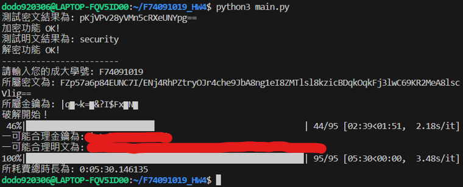

# 2023_Information_Security_HW4_in_NCKU

This is a repo for solving HW4 in 2023 Information Security courses in NCKU, in which a program should be designed to break an AES key according to known ciphertexts and parts of keys.

## Prerequisites
* Python 3.8.10
* pip 20.0.2

## Get Started
To get started, you should clone this repo and enter it.

```bash
$ git clone https://github.com/dodo920306/2023_Information_Security_HW4_in_NCKU.git
$ cd 2023_Information_Security_HW4_in_NCKU
```

Next, install pycryptodome in order to do AES

```bash
$ pip install pycryptodome
```

and install tqdm for multiprocessing.

```bash
$ pip install tqdm
```

Then you are good to go! Run

```bash
$ python main.py
```

, enter your student id in NCKU, and wait minutes to get the result!

The following are the detail for the principle of this program.

## Testing
The problem includes AES in ECB mode with zeropadding. All using utf-8 as character encoding.

In the beginning of the program, in order to check the encryption setting and the environment is functional, the program will use "123456789" in plaintext as key to encrypt the word "security". If every thing is OK, the ciphertext should be "pKjVPv28yVMn5cRXeUNYpg==".

Next, likewise, in order to check the decryption setting and the environment is functional, the program will use "123456789" in plaintext as key to decrypt the previous ciphertext "pKjVPv28yVMn5cRXeUNYpg==". If every thing is OK, the result should be the original plaintext "security".

## Input
Then, the program will ask users to input their student id in NCKU, this should be a string with length 9 and a number as the last character. Any invalid input that doesn't follow these two rules will be blocked.
In response to what number the last character in input moduloing 5 is, let us say that is x, the program will get the corresponding ciphertext and key according to the following table.
| x | ciphertext | key |
|-|-|-|
|0|2NHkjlDyk82JBke5q8CnMQZ1iiHID8QEst+/Ld6lWFMP5omXXh/1LnmrYKOD04idKfzfL+6C96391/iN7+X0eg==|$"▆vXl▆K▆\/ {9Fp▆|
|1|INNkAZHIpe5u9LvzhH24VyORcZQVDCFXzV6V/l9M7rpgqskMxvaRbGwR2dZaxMDZ|0lOS▆b] ▆&N) ▆w▆@+|
|2|NnJyrVT80DxOU5jOxHdZ9NRlaLPRhaAUYANfaVACUeqcrPoXz5eeTs9m6X2fVJC9SJ+X03mu3zD/WTiUjwzIyg==|Bk▆fom] ▆H▆ (J▆'|,|
|3|89NEvN56VtNjo1w5x3whmFUOZOqTaRyoMnIrPjCGKUv5n7kgGFHDmStzEgDFAU7QnZOK9MLeO/FW4etzIOhpKfOsw5xSD4Em72X1O2FRfaM=|2▆? ▆mYD;@▆;x▆v\"i|
|4|FZp57a6p84EUNC7I/ENj4RhPZtryOJr4che9JbA8ng1eI8ZMTlsl8kzicBDqkOqkFj3lwC69KR2MeA8lscVlig==|\|q▆~k=▆&?I$Fx▆N▆|

'▆' indicates unknown characters in keys. That's why we can't get the plaintexts.

## Solving
If every thing is OK, the program will start solving the key and the plaintext. 

The way the program use is just brute-force. The program will iterate through every possible byte in ASCII to replacing each '▆'. Since there are four '▆' in every key, the program will run a 4-level for-loop in order to get the correct combination in $(2^8)^4$ possible ones.

A progress bar is there to allow users to check if the program is still working.

## Result
A functional result should look like this


